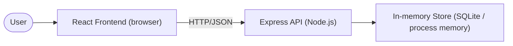

# Cloud Architecture Overview

## System Context



Notes:
- Monorepo with React SPA talking to Express API.
- API persists tasks in process-scoped storage (in-memory SQLite backing).
- No external services or cloud provider specifics.

## Sequence: Creating a TODO

```mermaid
sequenceDiagram
    participant U as User
    participant F as React Frontend
    participant A as Express API
    participant S as In-memory Store

    U->>F: Enter title/fields and submit
    F->>A: POST /api/tasks {title, description?, due_date?}
    A->>S: Insert task (validate title; optional due_date)
    S-->>A: Stored task {id, title, description, due_date, completed}
    A-->>F: 201 Created with task payload
    F-->>U: Show new TODO in list
```
